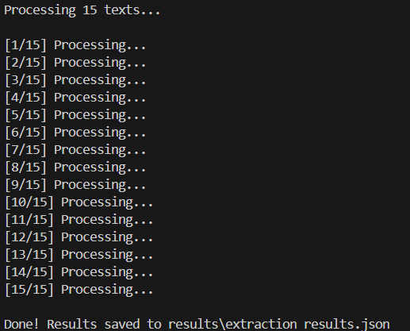
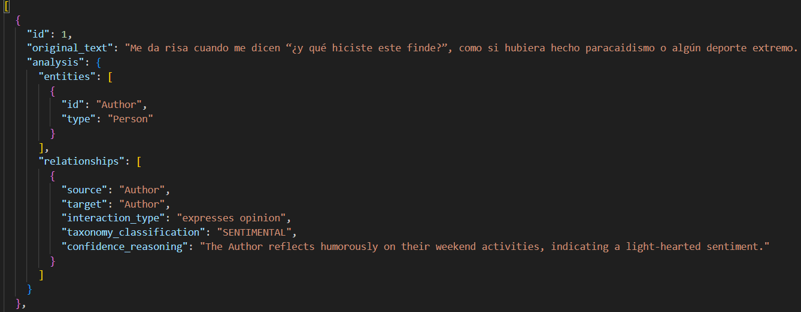

# Detection Taxonomy Extraction Layer

This repository contains the refactored Extraction Layer for the Detection Taxonomy project. The system uses a **Unified Generative Extraction Layer** to perform Named Entity Recognition (NER) and Relation Extraction (RE) in a single pass.

## 🎯 Architectural Evolution
Following the architectural review, we pivoted from fragmented Hugging Face micro-models to a robust, unified solution using OpenAI's `gpt-4o-mini`. 

**Key Improvements:**
* **Zero Syntax Errors**: Utilizes `response_format={"type": "json_object"}` to guarantee 100% valid JSON outputs.
* **Efficiency**: Reduced API latency and costs by consolidating 7 classification tasks into one.
* **SNA Focus**: Improved entity mapping (replacing pronouns with roles like "Author" or "Target") to provide clean data for Neo4j Graph Databases.

## 🧠 Model Documentation
* **Primary Model**: `gpt-4o-mini`.
* **Justification**: Selected for its superior reasoning in multi-language contexts (PT, ES, EN) and its ability to maintain strict structural integrity in complex extractions.

------------------------------------------------------------------------

## 🛠️ Setup & Installation

### 1. Environment Configuration

Set up a virtual environment and install the project dependencies to
ensure consistency.

``` bash
python -m venv venv

# On Windows
.\venv\Scripts\activate

# On Linux/macOS
source venv/bin/activate

pip install -r requirements.txt
```

------------------------------------------------------------------------

### 2. Configuration

Create a `.env` file in the root directory to store your Open AI
API key securely:

    OPENAI_API_KEY=your_api_key_here

**Note:** The `.env` file is excluded from version control via
`.gitignore` for security.

------------------------------------------------------------------------

### 3. Running the Extractor

Execute the unified script to process text and generate the JSON output:

``` bash
python detect.py
```

------------------------------------------------------------------------

## Model Documentation

**Model used:** `gpt-4o-mini`

### Reasoning

The model was selected for the production pipeline to ensure 100% structural integrity of the extraction layer. The main reasons for this choice are:

    Native JSON Mode: By utilizing the json_object response format, the system eliminates the syntax and truncation errors previously experienced with smaller open-source models.

    Unified Extraction: It successfully consolidates the 7 previous micro-models (such as DeepSeek-R1 and Twitter-RoBERTa) into a single, high-performance generative layer, significantly reducing API latency and token waste.

    SNA Logic Implementation: The model demonstrates superior ability in following complex instructions to replace pronouns with specific roles (e.g., "Author", "Target"), which is essential for the quality of the Neo4j Graph Database.

    Multilingual Accuracy: It maintains high precision in identifying taxonomy categories (Extremist, Hate, Emotional, etc.) across Portuguese, Spanish, and English texts.

------------------------------------------------------------------------

## Results & Screenshots

The system was tested using the `examples.txt` dataset, covering complex social scenarios in Portuguese, Spanish, and English. The extraction layer successfully identified entities and mapped relationships into the required JSON schema.

The system successfully identifies entities and classifies relationships
based on the **7 defined taxonomy categories**:

-   Extremist
-   Hate
-   Radicalism
-   Threat
-   Violated
-   Emotional
-   Sentimental

Below is an example of a multi-layered relationship extraction (ID #5 from `extraction_results.json`), demonstrating the model's ability to identify both a rights violation and hate speech in a single passage:

```json
  {
    "id": 5,
    "original_text": "I was taken to the Brazilian Supreme Court for saying the most voted \"woman\" in the country is actually a man. After five years of persecution, I won.",
    "analysis": {
      "entities": [
        {
          "id": "Brazilian Supreme Court",
          "type": "Institution"
        },
        {
          "id": "woman",
          "type": "Group"
        }
      ],
      "relationships": [
        {
          "source": "Author",
          "target": "Brazilian Supreme Court",
          "interaction_type": "was taken to",
          "taxonomy_classification": "VIOLATED",
          "confidence_reasoning": "The Author faced legal action, indicating a rights violation."
        },
        {
          "source": "Author",
          "target": "woman",
          "interaction_type": "criticizes",
          "taxonomy_classification": "HATE",
          "confidence_reasoning": "The statement implies a derogatory view towards the group."
        }
      ]
    }
  }

To validate the efficiency and structural integrity of the newly implemented Unified Extraction Layer, the following screenshots demonstrate the system's performance during batch processing and the final validated JSON output.

Terminal Output: Illustrates the real-time analysis of the examples.txt dataset using the gpt-4o-mini model, showing consistent processing without truncation errors.



JSON Results: Displays the final structured data, highlighting the successful mapping of entities and relationships according to the 7 defined taxonomy categories.




